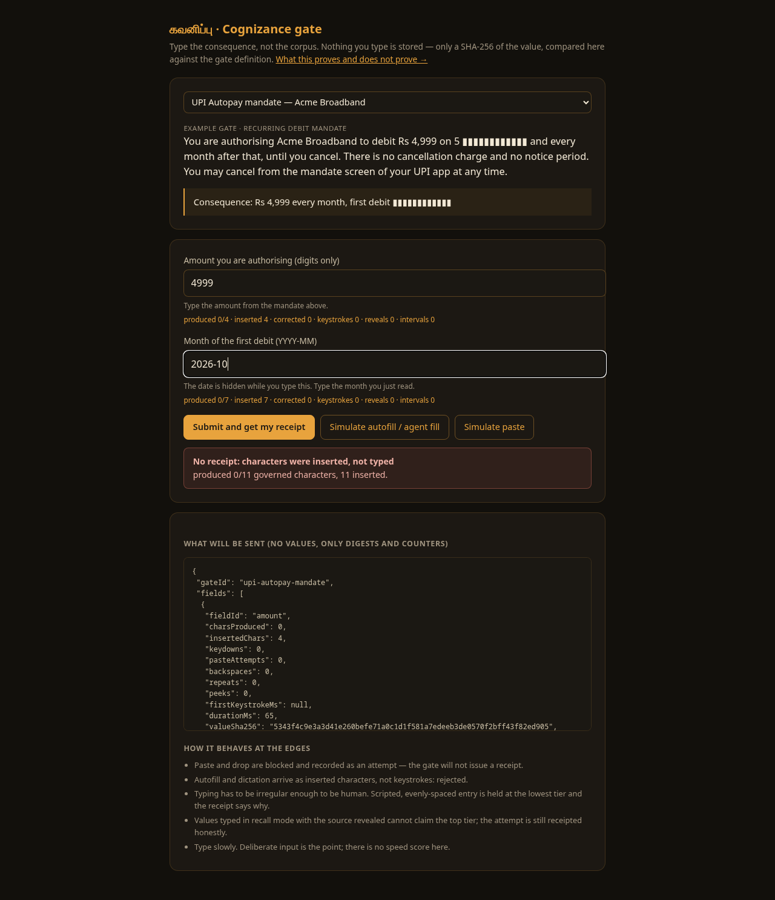
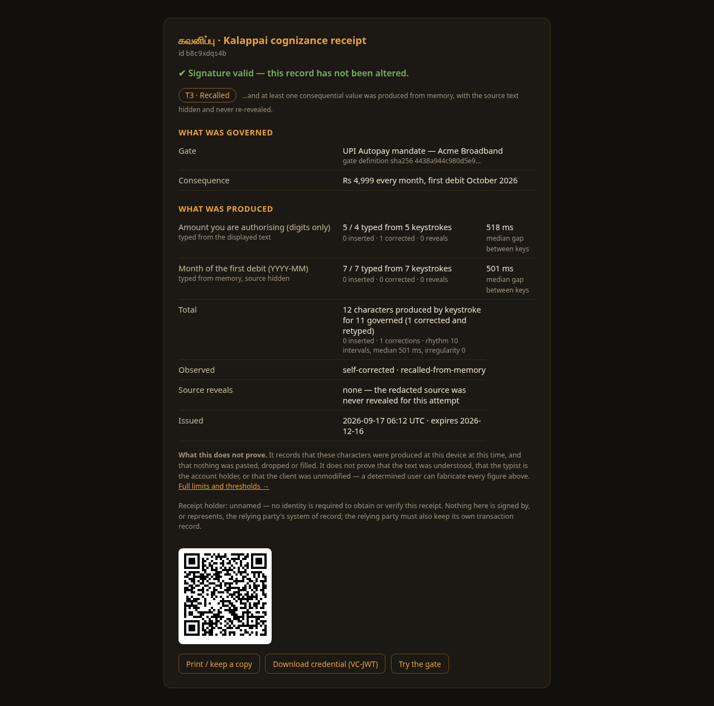

# kalappai-cert (சான்றிதழ்) — certification service for Kalappai

Standalone backend for the [Kalappai (கலப்பை)](https://github.com/LogicIncZo/kalappai)
Tamil typing tutor. Any client session that has completed an exam can POST its
score here and receive a signed, publicly verifiable certificate.

**Zero vendor lock-in, zero external services**: Hono + SQLite (bun:sqlite) +
`qrcode`. One Bun process, one DB file.

## What issuance produces

Each passed attempt is stored twice-protected:

1. **HMAC-protected SQLite record** — tamper-evident; `GET /api/certificates/:id`
   recomputes the HMAC and reports `signatureValid`.
2. **W3C Verifiable Credential** — VC 2.0 with a JWT proof (EdDSA / Ed25519),
   carrying an **Open Badges 3.0**-shaped achievement (1EdTech shape) with the
   learner-entered alias. The VC-JWT is downloadable from the verify page and
   verifiable offline against the public key in `/.well-known/jwks.json`.

The public verify page at `/certs/:id` renders the certificate, a **QR code
pointing back at itself** (scan → anyone can verify), a print button
(print-ready layout), and the raw VC-JWT.

A certificate from Kalappai is a **practice record, not a government
qualification** — the verify page says so explicitly.

## Endpoints

| Method | Path | Purpose |
| --- | --- | --- |
| POST | `/api/certificates` | Issue. Body: `{ alias, layoutId, passageId, targetHash, chars, stats: { grossWpm, netWpm, accuracy, errors, strokes, kdph, elapsedMs } }` → `{ id, issuedAt, signature, verifyUrl, vcJwt }` |
| GET | `/api/certificates/:id` | JSON verification: full record + `signatureValid` |
| GET | `/api/certificates/:id?sig=<sig>` | Verifies that the record matches the given signature (tamper probe) |
| GET | `/certs/:id` | Human verify page: certificate, QR, print, VC-JWT download |
| GET | `/api/issuer` | Issuer metadata (`id`, name, publicKeyJwk) |
| GET | `/.well-known/jwks.json` | Public key (JWKS, Ed25519) |
| POST | `/api/cognizance/session` | Open a cognizance gate session. Body: `{ gateId }` → `{ sessionId, gate }` — the gate definition with recall secrets already redacted |
| POST | `/api/cognizance/session/:id/reveal` | Reveal the redacted source. Counted by the issuer; a reveal forfeits `T3` |
| POST | `/api/cognizance` | Submit keystroke telemetry. Body: `{ sessionId, gateId, fields[] }` → `{ id, tier, verifyPath, vcJwt }`, or `422` with a `reason` |
| GET | `/api/cognizance/:id` | JSON verification for a receipt + `signatureValid` |
| GET | `/api/cognizance/gates` | Gate catalogue (redacted) with each gate's SHA-256 |
| GET | `/cognizance` | The demo gate — try it in a browser |
| GET | `/cognizance/r/:id` | Human receipt page: tier, per-field residue, QR, print, VC-JWT download |
| GET | `/cognizance/limits` | What a receipt asserts, what it does not, the thresholds, known false negatives |

**Pass rules are enforced server-side** (accuracy ≥ 90%, ≥ 30 s, ≥ 120 chars) —
a client cannot talk its way to a certificate.

`targetHash` is the SHA-256 of the exact passage typed, binding the credential
to the exercise rather than to a claim.

## The cognizance gate (கவனிப்பு) — "was this produced, deliberately, by a human?"

A second, independent function of this service. Where `/api/certificates` records a
*typing score*, the cognizance gate records that a person **produced** a few
consequential values themselves, and issues a signed receipt of that fact.

It is **not bot detection** and not authentication. There is no adversary here: the only
party who can defeat the gate is the person whose attention it is meant to secure. What
it removes is the zero-effort path to a submission — paste, autofill, dictation, an agent
driving the browser — and what it leaves behind is a two-sided receipt.

A **gate** is a short statement plus a handful of governed values to be typed — *type the
consequence, not the corpus*. A value is either `transcribe` (visible in the statement) or
`recall` (**never rendered**: the served statement has the secret blanked out, and the full
text is reachable only through a reveal, which the *issuer* counts).

Tiers are additive, and a withheld tier always states why on the receipt:

| Tier | Claim |
| --- | --- |
| `T0` produced | Every governed character came from a keystroke; nothing pasted, dropped or filled |
| `T1` deliberate | …and the pooled typing rhythm is not machine-regular |
| `T2` attentive | …and the entry shows a hesitation or a self-correction |
| `T3` recalled | …and a concealed value was produced from memory, with the source never revealed |

Design rules the code enforces:

1. **Recompute, never trust.** The client sends raw inter-keystroke samples and counters;
   coverage, timing, regularity and the tier are decided server-side.
2. **Server-counted reveals.** A gate session is opened server-side and reveals are counted
   there, so a silent client cannot buy `T3`.
3. **Keystrokes are required.** Text arriving with no preceding `keydown` — `insertText`,
   dictation, an agent filling the field — is counted as insertion and refused, whatever
   its `inputType` claims.
4. **Content-free receipts.** Values are compared by SHA-256 against the gate definition
   and never stored; the evidence record holds digests and counters only.
5. **A non-typing route must exist.** Dictation, switch access and autofill are rejected by
   design, so a deployment owes those users an alternate route to the same receipt type.

Receipts are W3C VC 2.0 (the same EdDSA VC-JWT and JWKS as the certificates), typed
`CognizanceReceipt`, with an evidence block and the honest limits carried in `termsOfUse`.
Verify at `/cognizance/r/:id`, try it at `/cognizance`, read the limits at
`/cognizance/limits`.




The three gates in `src/cognizance.ts` are illustrative examples with no real PII. In a
deployment, the gate definitions belong to the relying party and this service only issues
and verifies.

## Configuration

| Env var | Meaning |
| --- | --- |
| `PORT` | Listen port (default 8123) |
| `KALAPPAI_CERT_SECRET` | HMAC secret. If unset, an ephemeral per-day secret is used and HMACs do not survive restarts (warned at boot). Set it in production. |
| `KALAPPAI_CERT_DB` | SQLite path (default `./data/certs.db`). The Ed25519 issuer key is persisted next to it as `issuer-key.json` (created on first boot). |
| `KALAPPAI_CERT_BASE` | Public base URL — appears in QR codes, credential ids and `verifyUrl` |
| `KALAPPAI_CERT_ORIGIN` | CORS allow-origin (default `*`) |
| `KALAPPAI_COGNIZANCE_TTL_DAYS` | Receipt validity window for cognizance receipts (default 90 days) |

The VC signature (Ed25519) always survives restarts — the keypair is persisted
— but the database HMAC needs `KALAPPAI_CERT_SECRET` to do so.

## Run

```sh
bun install
KALAPPAI_CERT_SECRET=$(openssl rand -hex 32) \
KALAPPAI_CERT_BASE=https://cert.example.com \
bun src/index.ts
```

Tests (self-contained, spawns its own instance on a random port, covers issue →
verify round-trip, VC-JWT Ed25519 verification against the JWKS, DB-tampering
detection, pass-rule rejection, CORS):

```sh
bun test ./test/
```

## Deployment (Zo Computer)

Runs as a Zo user service `kalappai-cert` (http mode, port 8123):
`cd /path/to/kalappai-cert && bun src/index.ts`, with `KALAPPAI_CERT_DB`,
`KALAPPAI_CERT_BASE`, `KALAPPAI_CERT_ORIGIN` set as service env vars.

Live instance: <https://kalappai-cert-cashlessconsumer.zocomputer.io>

The PWA client (kalappai repo) keeps the server URL user-configurable — the app
is fully functional offline; certification is opt-in.

## License

GPL-3.0-or-later. Runtime dep: `qrcode` (MIT) — see NOTICE.md.
